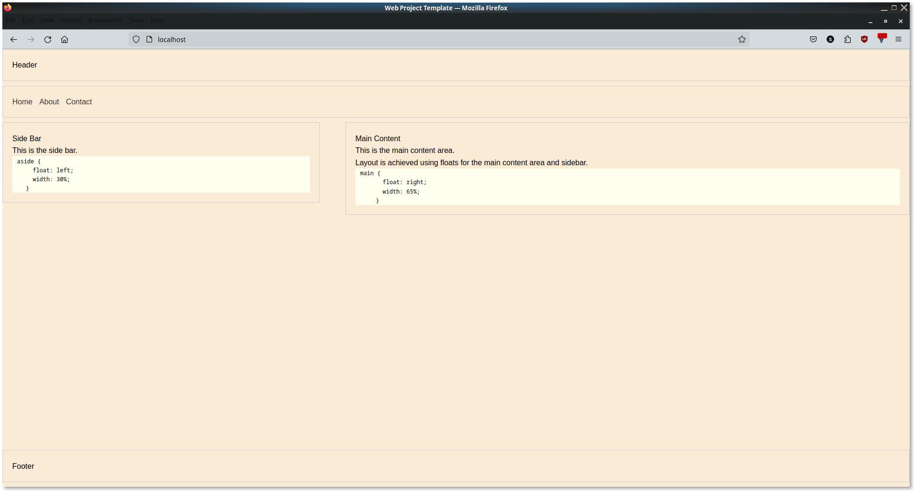

# Docker container and deployment process

Here we go through the creation of a sample dockerized project and deploy it to a server using a custom github runner.

## Clone repo

We're going to use a static website template I use as material to be hosted, along with nginx as the base webserver.

```git clone git@github.com:aaron-imbrock/html_css_js-template.git```

## Create docker image

A Dockerfile defines the build steps of an image. Here we create a Dockerfile, called `app.Dockerfile`, and includes build steps.

```text
# app.Dockerfile

FROM nginx

EXPOSE 80/tcp
# docker build -f app.Dockerfile -t our_docker_image_name .
# Period at end specifies path where to find our file to copy
COPY . /usr/share/nginx/html
```

To create the docker image we use the `docker build` command:

```linux
docker build -f app.Dockerfile -t our_docker_image_name .
```

List the docker images and you'll see the image we just created:

```linux
$ docker image ls
REPOSITORY                                                                           TAG               IMAGE ID       CREATED         SIZE
our_docker_image_name                                                                latest            20db900d88a3   4 minutes ago   187MB
```

## Run docker image

A running version of a docker image is called a container. To spawn a docker container we use `docker run`:

```linux
docker run -p 80:80 our_docker_image_name

docker run -p browser:container container_image
```

Nginx by default runs on port 80. But this port resides within the docker container and is accessible only within the docker container namespace.
If you were to access the website from your browser, residing outside the container namespace and on the host, that port would not be accessible.

Using `-p 80:80` we specify the port of the host system on the left, and the nginx port within the docker container on the right: `-p browser:container`.

### Note

Port forwarding cannot be configured from a Dockerfile. The `EXPOSE` instruction doesn't actually publish the port. It functions as a type of documentation between the person who builds the image and the person who runs the container, about which ports are intended to be published. Your options are the `docker run` command, or `docker compose` which we'll cover next.

## Confirm it works

Using curl from the host, we can access nginx port 80 from within the container:

```linux
$ curl -v localhost:80

< HTTP/1.1 200 OK
< Server: nginx/1.25.4
< Date: Fri, 15 Mar 2024 00:01:42 GMT
< Content-Type: text/html
< Content-Length: 1159
< Last-Modified: Thu, 14 Mar 2024 23:29:56 GMT
< Connection: keep-alive
< ETag: "65f38874-487"
< Accept-Ranges: bytes
<
<!DOCTYPE html>
** some html
```

Similarly from the browser at [http://localhost:80](http://localhost:80):



## Docker Compose

Even though it's overkill for this project let's create a docker-compose file. Everything from the `Dockerfile` could reside in your `docker-compose.yaml` file, however it's common to to use a Dockerfile for building each container and `docker-compose` for handling runtime parameters, especially when your project uses multiple containers.

This is an example `docker-compose.yaml` file. We're not going to use it but it illustrates the relationship between the two files:

```linux
     1 version: '3'
     2
     3 services:
     4   web:
     5     build: .
     6     command: gunicorn project.wsgi:application --bind 0.0.0.0:8000 --workers 4
     7     volumes:
     8       - .:/code
     9     ports:
    10       - 8000:8000
```

At line 3 we define the services. This section is used to define the containers and their configurations that make up your application. In this case, there's a single service named web.

* `web`: This is the name of the service, and it can be anything you choose. It's used to refer to this service in Docker Compose commands.
  * `build: .`: This tells Docker Compose to build an image using the Dockerfile in the current directory (.)
  * `command`: Specifies the command to run inside the container. Here, it's running gunicorn.

Here is ours. We run it with `docker compose up`.

```linux
# docker-compose.yaml
version: '3'

services:
  web:
    build:
      context: .                  # Dir where Dockerfile and source code are located. It's the starting path.
      dockerfile: app.Dockerfile  # The name of the Dockerfile to use. Otherwise assumed to be Dockerfile
    ports:
      - "80:80"
```

## Deploy Process

So far we've covered dockerizing a project and shown how to run it locally. More than likally you want this pushed to a server and made accessible to the public.
We could do that manually (but we won't) or we could create automation that would do this for us. GitHub Actions makes this easy.

### Preparation

You have to configure a couple things first. A $5USD virtual machine running on Digital Ocean will more than meet your needs and includes a free IPv4 address.

### Step 0

* Have a remote server ready and available.
* Configure the DNS records of your domain to point to the IP of the server you just created.
* Optional: Configure SSL Certificates
* Optional: Configure a wildcard subdomain for your domain, so that you can have multiple subdomains for different services
* Install and configure Docker on the remote server (Docker Engine, not Docker Desktop).

### Install GitHub Actions Runner

